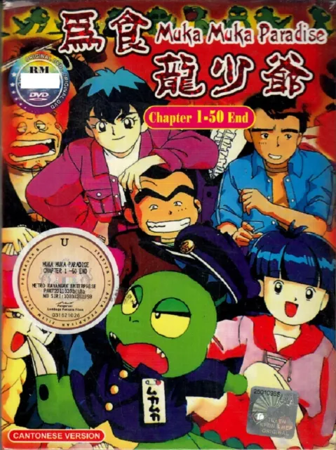

# Improving the fidelity of the Cantonese Dub of Muka Muka Paradise (1993)

This is will be my first blog post. I don't like statements of purpose and such so I'll get right into it.



>_**Muka Muka Paradise**_ (Japanese: ムカムカパラダイス) is a manga series by [Yumiko Igarashi](https://en.wikipedia.org/wiki/Yumiko_Igarashi "Yumiko Igarashi") and Fumiko Shiba, serialized between March 1993 and September 1994 in Shogakukan's _[Ciao](https://en.wikipedia.org/wiki/Ciao_(magazine) "Ciao (magazine)")_ magazine. It was later adapted into a 51 episode anime that aired in Japan between September 4, 1993, and August 27, 1994. The story revolves around a young girl named Uiba Shikatani and her newly found pet dinosaur, which is named after the only words that come out of its mouth, _Muka Muka_.

A broadcast version of this series dubbed in Cantonese aired in Hong Kong in the 90s. In 2020, a friend of mine talked about watching **Muka Muka Paradise** in Cantonese as a child and so I decided to see if I could find a copy online. 

## Obtaining a copy of the source

The two types of listings on Nyaa are either 1. [unseeded](https://nyaa.si/view/518315) or 2. [a rip of the original Japanese copy](https://nyaa.si/view/1260249). No luck there. So I went on eBay and looked for a copy.


![[mukamuka_receipt.png]]

Found it for $40 on eBay. Feeling that there are only a couple copies left (especially those available to the Western market) and that if I didn't buy this it might get lost forever, I purchased a copy. I realized I didn't have a DVD drive so I had to buy one of those too.

![[mukamuka_disc.jpeg]]
When the discs arrived, I threw them in the DVD drive and I ripped the video files with [Handbrake](https://handbrake.fr/) . I don't have any screenshots from when I did this so you'll have to use your imagination.

To little surprise, the video quality of the content on these discs were horrendous. They have artifacts from being re-compressed and a black border along the bottom and right edges.

![[mukamuka_screenshot_1.png]]

## Using a better video source

Earlier I mentioned that one of the listings on Nyaa was a rip of Japanese language DVD. Well, it turns out that the Japanese DVD copy of the series has few of the issues that the HK DVD has. Here are some comparisons of screencaps (left is the HK DVD and the right is the JP DVD):


The next move is to rip the Cantonese audio of the Hong Kong DVD and add it as an audio track to the Japanese DVD rip. Here's a simple bash script to rip the audio (assuming there's only 1 audio track per video file and the audio track is AC3 encoded).

```
#!/bin/sh
for file in *.mkv
do
  filename="${file%.*}"
  ffmpeg -i "$file" -vn -acodec copy audio/"$filename".ac3
done
```

## Syncing the Cantonese audio to the Japanese video source

Now normally one would just add another audio track to the video file after some slight audio syncing but after episode 1, the Cantonese version truncates the OP and ED during each episode while the Japanese version includes them. And on top of that, the Cantonese version also cuts out the commercial bumper. So we need to do some work to 

1. Find where the Cantonese version fits within the Japanese audio track
2. Splice it inbetween the OP and ED
3. Find where the commercial bumper is
4. Splice the commercial bumper into the Cantonese dub track
5. Normalize the audio levels

### Calculating where to splice the audio
Firstly, I need to find where OP ends and the title card begins on the Japanese audio track, which gives me where the Cantonese audio track should start. Secondly, I need to find where the commercial bumper starts and ends so I can splice that into the middle of the Cantonese track. There are 50 episodes of **Muka Muka Paradise** (well really 51 but the Cantonese dub for some reason only has 50); I'm going to have to write a script to do this for me because I really don't feel like doing this manually.


## Links

You can find a copy of the compiled episodes here:

And 


## A cute detail

In episode 2 of **Muka Muka Paradise** there's a scene where a couple of thieves are talking in a public bathroom. In the Japanese audio, the voices are recorded normally. But in the Cantonese audio, it sounds like they actually recorded that bit in an empty room like a bathroom because there's an echo. Sometimes dubbers go the extra mile.

## Addendum

Since I mainly focused on the technical parts of this endeavor, I wanted to add a small note about that turned out to be incidentally related. Recently I was reading chapter 396 of **Hunter × Hunter**, which focuses on the Phantom Troupe's origin as a group of fan dubbers for their home community of Meteor City, a region invisible to the media companies of their world. Chrollo finds a VHS copy of the **Power Washers** (an in-universe Super Sentai/Power Rangers-esque franchise) and decides to gather a group of local children to help record a dub track for the other children in Meteor City.

![[hxh_396_page_6.png]]

In general, I am on the side *against* dubbing in the sub/dub wars. To provide context for this, it's because I find that the residents of the Anglosphere could stand to have some exposure to (and the subsequent discomfort of) hearing foreign languages and foreign voices. Reading H×H chapter 396 reminded me of the flipside of this and how important it can be and how powerful it can feel for an audience to hear their native tongue in a media landscape often dominated by a few large nations. And more than that, that dubbing itself, especially from the fan community, can be an art (and maybe outsider art like in the context of this chapter).

![[hxh_396_page_15.png]]

So thank you Togashi again for reminding me that the world is a big place with a lot of people and the desire to strive and create is never in short supply as long as you keep your eyes open.

—TK
